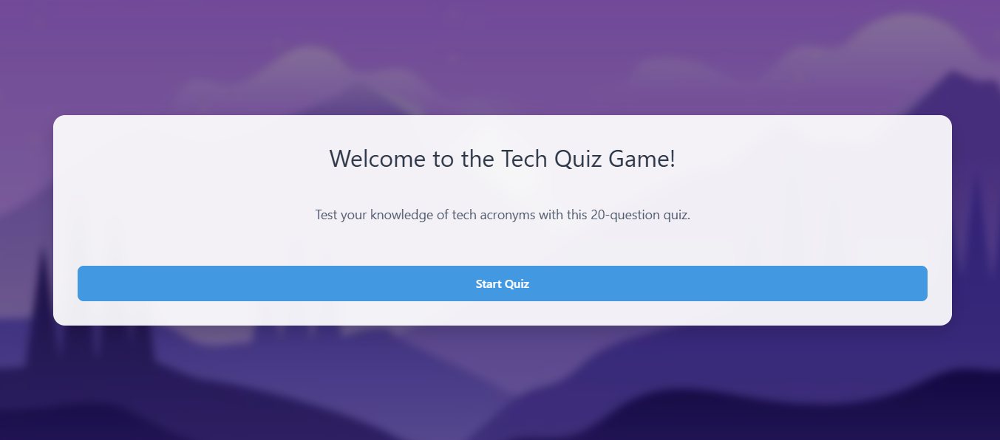

# QUIZ_GAME

A web-based interactive Tech Quiz Game where users can test their knowledge of technology acronyms and terms! Built using Python (Flask), HTML, and CSS, the game provides a smooth, visually appealing quiz experience directly in your browser.

---

## Table of Contents
- [Demo](#demo)
- [Features](#features)
- [How It Works](#how-it-works)
- [Project Structure](#project-structure)
- [Installation](#installation)
- [Usage](#usage)
- [Customization](#customization)
- [Contributing](#contributing)
- [License](#license)

---

## Demo



---

## Features

- **20 Tech Acronym Questions:** Test your knowledge of popular tech terms and acronyms.
- **Interactive UI:** Start, play, skip, and submit answers through a modern, responsive interface.
- **Immediate Feedback:** Instantly know if your answer is correct and see the right answer when wrong.
- **Progress Tracking:** See your current score and quiz progress.
- **Results Screen:** Get personalized feedback and your final score with motivational messages.
- **Replay Option:** Easily restart the quiz and improve your score.
- **Responsive Design:** Fully optimized for desktop, tablet, and mobile devices.
- **API-Driven Questions:** Questions and answer checking are processed via RESTful API endpoints.

---

## How It Works

1. **Welcome Screen:**  
   - The quiz starts with a welcome message and a 'Start Quiz' button.
2. **Quiz Flow:**  
   - Each question is displayed individually.
   - Users input their answer and submit.
   - Feedback is given immediately.
   - Progress bar shows how far you are in the quiz.
   - Option to skip questions.
3. **Results:**  
   - After 20 questions, see your total score, percentage, and a message based on your performance.
   - Option to play again.

---

## Project Structure

```
QUIZ_GAME/
├── app.py                # Main Flask application (serves API, HTML)
├── quiz_game.py          # Standalone Python CLI version (for terminal play)
├── templates/
│   └── index.html        # Main HTML template for the quiz interface
├── static/
│   ├── style.css         # Main stylesheet for the quiz UI
│   ├── qdesktop.jpeg     # Background image for desktop
│   ├── qtablet.jpeg      # Background image for tablet
│   ├── qmob.jpeg         # Background image for mobile
│   └── qlarge.jpeg       # Background image for large screens
└── README.md             # Project documentation
```

---

## Installation

### Requirements

- Python 3.7+
- Flask

### Steps

1. **Clone the repository:**
   ```bash
   git clone https://github.com/Norozahmed/QUIZ_GAME.git
   cd QUIZ_GAME
   ```

2. **Install dependencies:**
   ```bash
   pip install flask
   ```

3. **Run the web app:**
   ```bash
   python app.py
   ```
   The quiz will be available at [http://localhost:5000](http://localhost:5000).

---

## Usage

- **Web Version:** Open your browser and navigate to [http://localhost:5000](http://localhost:5000)
- **Terminal Version:** Run `python quiz_game.py` to play in your terminal.

---

## Customization

- **Add/Edit Questions:**  
  Edit the questions list in `app.py` for the web version, or in `quiz_game.py` for the terminal version.

- **Styling:**  
  Modify `static/style.css` for custom themes or UI changes.  
  Background images can be replaced in the `static/` folder.

---

## Contributing

Pull requests are welcome! For major changes, please open an issue first to discuss what you would like to change.

---

## License

This project is open source and available under the [MIT License](LICENSE).

---

*Enjoy testing your tech knowledge!*
